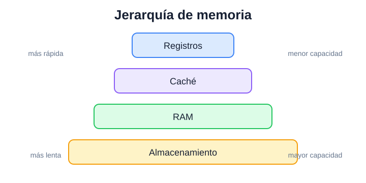

# Jerarquía de memoria

El caso que estresa diagramas técnicos, captions y relaciones espaciales.

## Por qué existe una jerarquía

No existe una única memoria que sea simultáneamente enorme, instantánea y barata. Por eso un sistema organiza distintos niveles con compromisos diferentes.

> [!DEFINITION] Idea central
> Los niveles más cercanos al procesador priorizan velocidad; los más alejados permiten conservar más información a cambio de mayor latencia.

**Cómo leer la figura:** no memorices sólo los nombres. Mirá la dirección general: al bajar en la jerarquía aumenta la capacidad disponible y también el tiempo necesario para acceder a los datos.

> [!WARNING] Error frecuente
> La figura representa una relación conceptual entre niveles. No implica que todos los equipos tengan exactamente la misma cantidad de niveles o tecnologías.

## Qué aporta el diagrama

En puro texto habría que reconstruir mentalmente qué está arriba, qué está abajo y qué variable cambia en cada dirección. El diagrama descarga esa reconstrucción y deja la explicación escrita para interpretar la relación.

> [!RECALL] Dibujalo
> Cerrá el apunte e intentá reconstruir la jerarquía y las dos tendencias principales sin mirar la figura.
