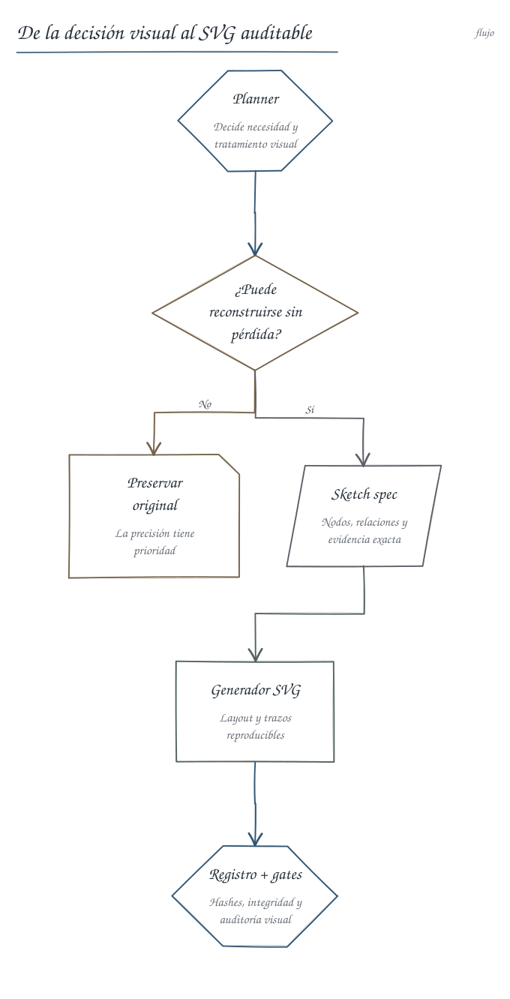

# Figuras SVG deterministas

University Study puede convertir una decisión visual del planner en un diagrama
estilo lápiz/cuaderno sin utilizar generación de imágenes por IA. La IA define
el contenido y la estructura; el core valida esa especificación, calcula el
layout, genera SVG reproducible y registra su procedencia.



## Límite de responsabilidades

- El planner decide `visual_required` / `visual_helpful` / `visual_not_needed` y
  `visual_treatment`.
- Para `reinterpret` y `preserve+derived_sketch`, la IA escribe una **sketch
  spec** JSON que contiene únicamente estructura semántica: nodos, formas,
  relaciones, grupos, orden y evidencia.
- `scripts/sketch_figure.py` decide tamaños, coordenadas, rutas, trazos, colores
  y tipografía. No interpreta fuentes ni inventa relaciones.
- `preserve` no pasa por el generador: el resumen utiliza el asset original.
- `preserve+derived_sketch` conserva el original y registra un segundo SVG
  simplificado, vinculado mediante `source_figure_id`.

El contrato machine-readable es
[`contracts/sketch-figure.schema.json`](../contracts/sketch-figure.schema.json).
Cada nodo, relación y grupo debe declarar `based_on`; esas referencias también
deben aparecer en el `based_on` global. Esto permite revisar exactamente de
dónde salió cada afirmación visual.

## Flujo de un resumen

1. El planner selecciona `visual_treatment: reinterpret` solo cuando la figura
   puede reconstruirse sin pérdida.
2. Escribe `02-sketches/<id>.json` y registra esa ruta en la entrada visual de
   `02-plan.json`.
3. El core valida la spec y genera dos archivos junto al asset:
   `<id>.svg` y `<id>.sketch.json`.
4. El mismo comando registra `derived:<id>` con hashes del SVG y la spec.
5. El Markdown utiliza el SVG local como cualquier otra figura.
6. `artifact_integrity.py` vuelve a verificar asset, spec, hashes, identidad del
   generador y metadatos embebidos; `visual_audit.py` comprueba el resultado en
   navegador, móvil e impresión.

El comando recomendado es idempotente:

```powershell
python scripts/venv_exec.py study.py figures generate-sketch <course> `
  --unit <unit-id> `
  --spec <run-dir>/02-sketches/<id>.json
```

También se puede validar o renderizar una spec sin tocar un curso:

```powershell
python scripts/sketch_figure.py validate --spec figure.json
python scripts/sketch_figure.py render --spec figure.json --output preview.svg
python scripts/sketch_figure.py audit --svg preview.svg
```

Una repetición con la misma spec devuelve el registro existente. El mismo ID
con contenido distinto, un asset previo o una spec modificada se rechazan sin
sobrescribir archivos.

Cuando el MCP local está conectado, la operación equivalente es
`study_generate_sketch_figure(course, unit, spec)`.

## Formas y estructuras soportadas

Tipos de figura:

- `flow`
- `tree`
- `concept-map`
- `relations`
- `technical-schematic`

Formas de nodo:

- `box`, `rounded`, `terminal`, `process`
- `decision`, `data`, `datastore`
- `circle`, `note`, `component`

La IA puede asignar `rank` y `order`, pero nunca píxeles, colores, fuentes o
estilos libres. Si omite los rangos, el generador obtiene capas deterministas a
partir de las relaciones declaradas. Para una relación que no sea un flujo
simple, el texto de la arista es obligatorio.

## Regla de fidelidad

No se debe reinterpretar una captura, un gráfico denso, una tabla visual, una
fórmula, un circuito, una geometría o una figura cuya escala y disposición sean
parte de la evidencia. En esos casos se usa `preserve`; si un esquema reducido
aporta un modelo mental adicional, se usa `preserve+derived_sketch` y se muestran
ambos assets.

El estilo lápiz es geometría SVG determinista: trazos dobles con microcurvas,
esquinas discretamente imperfectas y una paleta dominada por grafito/tinta. El
canvas es totalmente transparente y no dibuja papel, renglones, marco ni placa:
esas capas pertenecen al theme notebook real y quedan visibles detrás del SVG.
Nunca es un filtro aplicado sobre píxeles originales.
